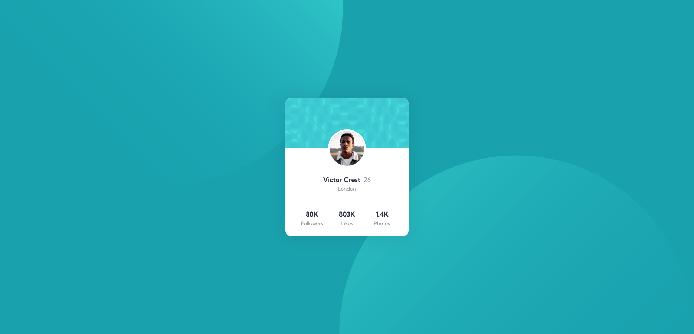

# Frontend Mentor - Profile card component solution

This is a solution to the [Profile card component challenge on Frontend Mentor](https://www.frontendmentor.io/challenges/profile-card-component-cfArpWshJ). Frontend Mentor challenges help you improve your coding skills by building realistic projects. 

## Table of contents

- [Overview](#overview)
  - [The challenge](#the-challenge)
  - [Screenshot](#screenshot)
  - [Links](#links)
- [My process](#my-process)
  - [Built with](#built-with)
  - [What I learned](#what-i-learned)
  - [Continued development](#continued-development)
- [Author](#author)

**Note: Delete this note and update the table of contents based on what sections you keep.**

## Overview

### The challenge

- Build out the project to the designs provided

### Screenshot

### Links

- Solution URL: [Add solution URL here](https://your-solution-url.com)
- Live Site URL: [https://gregarious-hummingbird-51cc2e.netlify.app/](https://gregarious-hummingbird-51cc2e.netlify.app/)

## My process

### Built with

- Semantic HTML5 markup
- CSS custom properties
- Flexbox
- CSS Grid
- Mobile-first workflow

### What I learned

Learned about a few accessibility options, as well as how to place decorative elements in the background using pseudo elements.

### Continued development

I'd like to learn more about accessibility, it's something that is becoming more important to me the more I read about it.

## Author

- Frontend Mentor - [@JonathanRe](https://www.frontendmentor.io/profile/JonathanRe)
- Twitter - [@kuogames](https://www.twitter.com/kuogames)

**Note: Delete this note and add/remove/edit lines above based on what links you'd like to share.**
